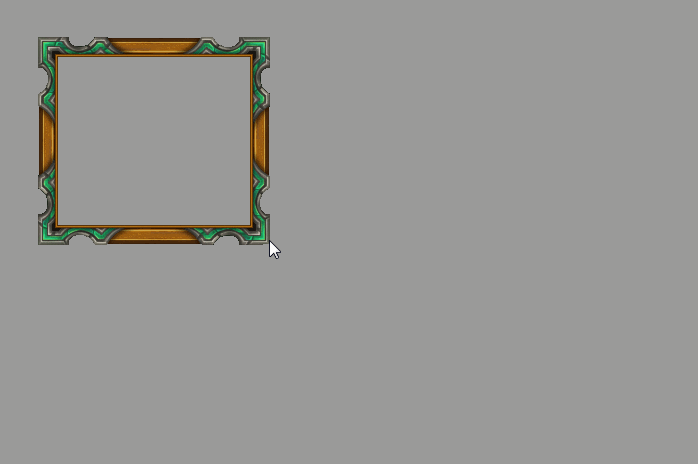
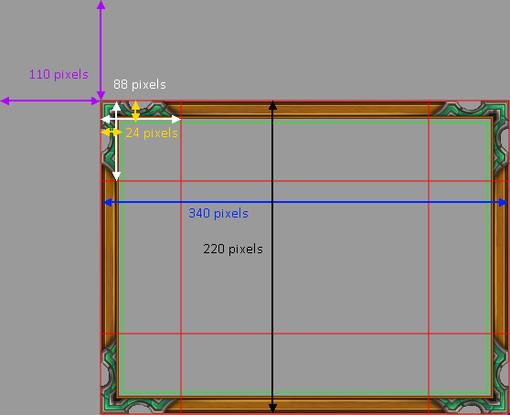
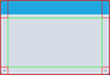

# Phaser3 9-slice Plugin

## What is 9-slice scaling?

**tl;dr:** See a [demo][demo-url]!

9-slice scaling is a technique to deform a 2D texture allowing it to be scaled
without deforming the corners.  Usually this is done to retain the shape or
embelishments on the corners. Wikipedia has a [good description][wiki]. But it's
pretty easy to show an example:



[wiki]: https://en.wikipedia.org/wiki/9-slice_scaling
[demo-url]: TODO

## Getting the plugin: Directly including it.

Include [`nineslice.js`](./dist/nineslice.js) in your project:

```html
<script type="text/javascript" src="//TODO"></script>
```

I used this method in the demo. The [source is included](./example) in this
repository.

## Getting the plugin: `npm` and `yarn`

TODO: publish

## Usage

Assuming you've included the plugin through one of the methods above there are
two final steps to enable usage in your project:

### 1. Enable the Plugin in your `Game` config:

```javascript
// Assuming you use use ES6 imports...
import * as NineSlice from 'phaser3-nineslice'

import { Scene1 } from './scene'

let phaserConfig = {
  type: Phaser.AUTO,
  parent: 'phaser-display',
  backgroundColor: '0x9a9a9a',
  width: 800,
  height: 600,
  plugins: {
    global: [ NineSlice.Plugin.DefaultCfg ],
  },
  scene: [ Scene1 ],
}

new Phaser.Game(phaserConfig)
```

You probably won't need to care but, internally, `DefaultCfg` is just defined
as `{ key: 'NineSlice', plugin: Plugin, start: true }` but any key can be used
if you need to change it.

### 2. Use the plugin to make 9-sliced objects!

The easiest way to construct a new sliced object is to use the new
`GameObjectFactory` method (`this.add.nineslice`) or the new `GameObjectCreator`
method (`this.make.nineslice`).

```javascript
  create() {}
    this.dlg = this.add.nineslice(
      110, 110,   // this is the starting x/y location
      340, 240,   // the width and height of your object
      'dlgLarge', // a key to an already loaded image
      88,         // the width and height to offset for a corner slice
      24          // (optional) pixels to offset when computing the safe usage area
    )

    // ... additional scene creation code
  )
```

Examining the resulting object added to your scene we can observe how the numbers
above are used.



**Spritesheets and Texture Atlases**

The fifth paramater is used to specify the texture and can be provided as a
string to use a loaded texture or an object with the structure

```javascript
{
  key: string,
  frame: string | number,
}
```

if you would like to specify a frame within a spritesheet or atlas indicated
by `key`.

**Non-uniform corner slices**

If your texture doesn't have uniform corners you can define the width and height
offsets of each independently using a slightly more complicated format. The same
true for the safe usage area (we'll discuss what this is later).

```javascript
this.dlg = this.add.nineslice(
  110, 110, 340, 240, 'kenny',
  [35, 15, 15, 15],
)
```

This results in the following texture slicing:



When an array is used it can be 1 to 4 elements and the values are assigned the
same way as when defining border offsets in CSS.

Array Length  | Use  | Explanation |
------------- | ---- | ----------- |
1 | `[ topRightBottomLeft ]` | The first (only) element is used as the value for all four sides
2 | `[ topBottom, leftRight ]` | The first element is used for the top and bottom, the second element is used as the for the left and right
3 | `[ top, rightLeft, bottom ]` | The first element is used for the top, second is used for the right and left, and the third element is used for the bottom
4 | `[ top, right, bottom, left ]` | Each element is assigned to a specific side

In addition to switching to on array to define the pixel offsets for the corners
our example also left out the safe area usage. Don't worry as it will be derived
from the four corner offsets as seen above by the green area. If an array is
used instead of a number it is expanded in the same way as

**Resizing your 9Slice**

Directly setting the `.width` and `.height` attributes will cause scaling issues
(TBD: bug). If you wish to change the object's size you should use `.resize`:

```javascript
  this.dlg = this.add.nineslice(
    110, 110, 340, 240, 'kenny',
    [35, 15, 15, 15],
  )
  // ...
  this.dlg.resize(400, 400)
```

If the call to resize would result in the safe area having an area of less than
0 it will only reduce it's size to that point.

**Direct Configuration**

In addition to the factory/creator methods you can construct a NineSlice directly:

```javascript
this.dlg = new NineSlice.NineSlice(
  scene,          // the parent scene of this objects
  sliceConfig,    // configures the source texture and layout of slice relative to it
  positionConfig, // specifies location and dimensions of the constructed object
)
```

For details about the structure of the config objects referenced above see
`NineSliceConfig` and `PositionConfig` in [`types.js`](./src/types.js).

They may also be passed to `.add` and `.make`:

```javascript
this.make.nineslice(sliceConfig, positionConfig)
```

**Summary**

Valid arguments to `.add.nineslice` and `.make.nineslice` are:

```
Arguments =
  | (NineSliceConfig, PositionConfig)
  | (x: number,
     y: number,
     w: number,
     h: number,
     source: FrameSelection,
     corner: OffsetConfig,
     safeArea: OffsetConfig)

FrameSelection =
  | key: string
  | {
      key: string,
      frame: number | string,
    }

OffsetConfig =
  | number
  | [topRightBottomLeft: number]
  | [topBottom: number, rightLeft: number],
  | [top: number, rightLeft: number, bottom: number],
  | [top: number, right: number, bottom: number, left: number]
```